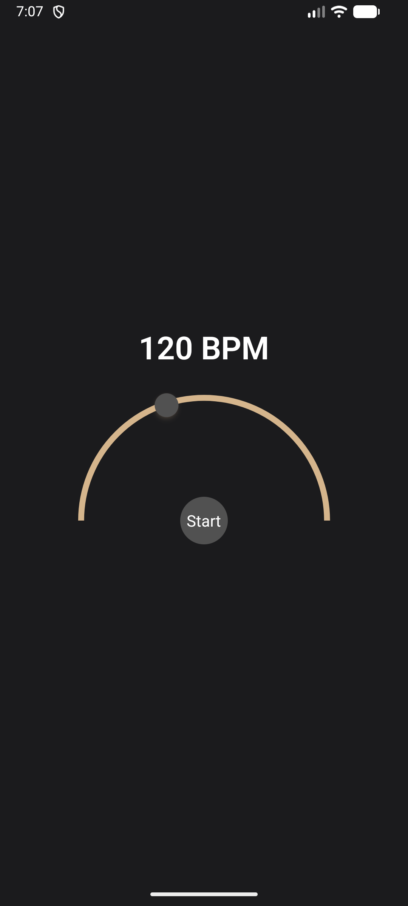
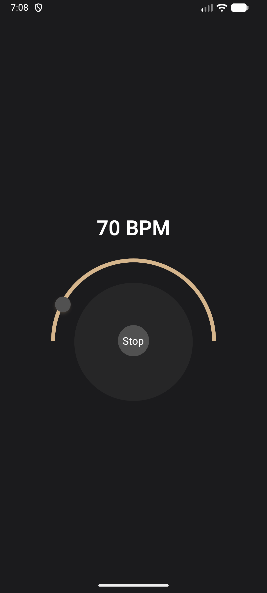

# Metronome App




## Setup

How to run this application on your device

This is a crossplatform React Native Typescript app, suitable for iOS and Android.
NOTE! This app was only tested on Android, however it should be possible to run it on iOS from scratch.

### Installation

- Make sure you have Node v20.\*+ installed.
  - Do not use any version younger, the dependencies won't work (package.json locks it).

- Make sure you have latest Android Studio and Java 17 on your machine.

- You should have expo cli to run this project. Install also EAS services for performing updates and creating custom builds.

```bash
npm i -g expo-cli
```

and

```bash
npm i -g eas-cli
```

This project uses `yarn` package manager. You have to install it globally first:

```bash
npm i -g yarn
```

then for dependencies installation

```bash
yarn
```

### Run on Android

```bash
npx expo run:android --device
```

This action will create local `/android` folder, which is added to git ignore. Then it will give you the choice to run on the attached (via USB) device, or local emulator. Preferably run this app on the real device, some dependencies might work incorrectly on the emulator.

### Run on iOS

NOTE: This app was not tested on iOS. Please, inform the developer if any problems or notes.

```bash
npx expo run:ios
```

This action will create local `/ios` folder, which is added to git ignore. To run it on your device you will need an Apple Developer Subscription. You can use simulator, however some dependencies might work incorrectly there.

### Build an app

To build an app, the EAS credentials are required. Only the owner can do it.
However, if you are on MacOS, you can still build Android .apk file locally:

```bash
eas build -p android --profile internal-android --local
```

Otherwise, Android .apk file (not locally):

```bash
eas build -p android --profile internal-android
```

### Design and Technical Decisions 

#### Navigation
_Absence of Navigation_

This app does not have any sort of Navigation (neither React Navigation nor Expo router) intentionally. This application scope is a single screen app, and introducing navigation would add more complexity.
If this application is about to grow and have more screens like `presets` or `settings`, then the Navigation would be introduced at that point.

#### Animation / Pulse

[`Reanimated`](https://docs.swmansion.com/react-native-reanimated/) package is used along with its dependencies to create smooth animations of moving knob when selecting the BPMs, and of pulsing circle when metronome is giving the sound. The package is optimised for iOS and Android.
The beat pulse visual indicator complements metronome audio feedback.

#### Audio

[`Expo Audio`](https://docs.expo.dev/versions/latest/sdk/audio/) is used to play the sound. Very scalable and easy to use library. Since it is and Expo project, it makes sense to use Expo provided package.

#### SVG

[`React Native SVG`](https://docs.expo.dev/versions/latest/sdk/svg/) is used to deliver the possibility to create curved stroke specific to this app UI.

#### BPM 
The default is 120 BPM - common musical standard. 
Limits 40 and 240 BPM - covers majority of the musical instruments to avoid audio and UX inaccuracy.

### Tradeoffs & Known Limitations

1. Fixed BPM range (40-240)
The tempo is limited to a practical range intentionally - slow and fast tempos are rarely used. Limits also help to keep audio and animations stable and not clapping on mobile devices.
2. Single time signature (4)
3. No sound selection
4. No presets
5. No history saved
Points 2-5 above could be potentially brought to the application in the future


### Future improvements

1. Polishing the mathematical and logical part of the animations - to be more precised with calculations of angles and positions.
2. Play with colors - try different pallette
3. Add more features and screens, like presets, history, sound selection, signatures or settings